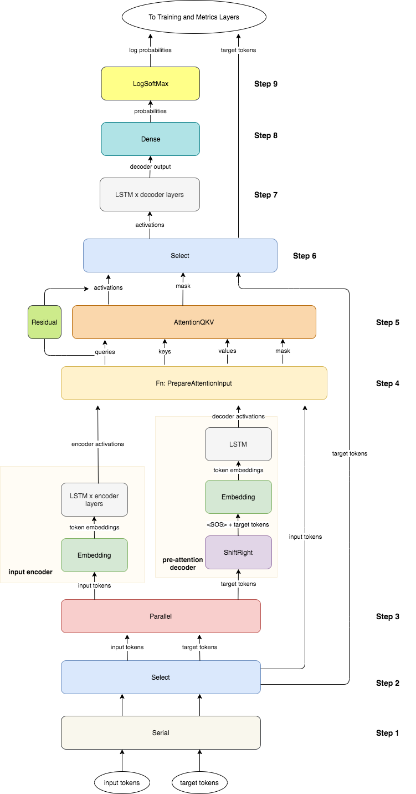

# Trax-for-Neural-Machine-Translation
Trax for Neural Machine Translation
Using encoder-decoder Attention LSTM for translating from English to German

## Anaconda environment

To set up the environment, execute in a terminal the followings:

* `conda create -n Machine-Translation`
* `conda activate Machine-Translation`
* `conda install pip`
* `pip install -r requirements-dev.txt`

# Neural Machine Translation

Here, you will build an English-to-German neural machine translation (NMT) model using Long Short-Term Memory (LSTM) networks with attention.  Machine translation is an important task in natural language processing and could be useful not only for translating one language to another but also for word sense disambiguation (e.g. determining whether the word "bank" refers to the financial bank, or the land alongside a river). Implementing this using just a Recurrent Neural Network (RNN) with LSTMs can work for short to medium length sentences but can result in vanishing gradients for very long sequences. To solve this, you will be adding an attention mechanism to allow the decoder to access all relevant parts of the input sentence regardless of its length. By completing this assignment, you will:  

- learn how to preprocess your training and evaluation data
- implement an encoder-decoder system with attention
- understand how attention works
- build the NMT model from scratch using Trax
- generate translations using greedy and Minimum Bayes Risk (MBR) decoding 